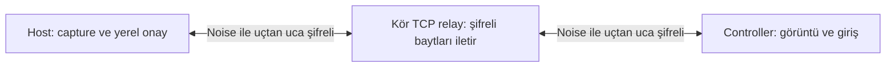

# RustView

RustView, Rust ile geliştirilen açık kaynak ve çapraz platform bir uzak masaüstü
uygulamasıdır. Hedefi; macOS, Windows ve Linux arasında ekran görüntüsünü paylaşmak
ve kullanıcının açık onayıyla fare/klavye kontrolü sağlamaktır.

> [!WARNING]
> RustView şu anda erken geliştirme aşamasındadır. Güvenlik incelemesi yapılmış,
> üretime hazır bir TeamViewer veya AnyDesk alternatifi değildir. Güvenmediğiniz
> kişilerle erişim parolanızı paylaşmayın ve hassas sistemlerde kullanmayın.

## İlk MVP'nin kapsamı

İlk kullanılabilir sürüm bilinçli olarak küçüktür:

- Tek ekranın yaklaşık **720p, 5-10 FPS JPEG** olarak paylaşılması
- macOS, Windows ve Linux/X11 üzerinde temel ekran yakalama
- Yerel kullanıcı onayından sonra temel fare ve klavye kontrolü
- İki istemci arasında uçtan uca Noise şifrelemesi
- Şifreli veriyi açmadan ileten basit bir TCP rendezvous/relay servisi
- Kalıcı, herkese açık 9 haneli cihaz kimliği; her uygulama açılışında yenilenen
  80-bit geçici erişim parolası ve her gelen istekte açık yerel onay

İlk MVP'de **yoktur**:

- Gözetimsiz erişim veya kalıcı parola
- Dosya aktarımı, pano senkronizasyonu ve ses aktarımı
- Windows UAC güvenli masaüstü ya da oturum açma ekranı kontrolü
- Wayland üzerinde güvenilir uzaktan giriş desteği
- Donanım hızlandırmalı video codec'i veya AnyDesk düzeyinde gecikme/bant genişliği
- Doğrudan P2P/NAT traversal; ilk MVP'de iki uç da relay'e bağlanır

Ayrıntılı kilometre taşları için [yol haritasına](docs/ROADMAP.md), işletim sistemi
sınırları için [platform destek tablosuna](docs/PLATFORM_SUPPORT.md) bakın.

## Nasıl çalışır?

RustView ilk açılışta bu kuruluma ait kalıcı, herkese açık 9 haneli bir `DeviceId`
üretir. Her uygulama çalıştırmasında ayrıca 16 karakterlik, 80-bit rastgele bir
`AccessPassword` üretir; bu parola diske yazılmaz ve uygulama içinden yenilenebilir.

Host'un kimliği ve geçici parolası, birbirinden ayrı domain'lerle 10 baytlık relay
route'una ve 32 baytlık Noise PSK'sına türetilir. Route yalnız herkese açık cihaz
kimliğinden türetilmez. Relay yalnız route değerini alır; cihaz kimliği, erişim
parolası ve PSK relay protokolünde düz metin gönderilmez. Eşleşen istemciler
`Noise_XXpsk0_25519_ChaChaPoly_BLAKE2s` el sıkışması yapar. Ekran ve giriş verisi
yalnız bu el sıkışmadan ve host tarafındaki açık yerel onaydan sonra taşınır.



Relay ekranı, giriş olaylarını, erişim parolasını veya türetilmiş Noise PSK'sını
okuyamaz. Buna karşın IP adreslerini, route değerini, bağlantı zamanlarını ve trafik
miktarı/zamanlaması gibi metadataları görebilir. Ayrıntılar
[güvenlik tasarımında](docs/SECURITY.md) yer alır.

## Gereksinimler

- Rust **1.92** veya üzeri
- macOS, Windows ya da Linux masaüstü ortamı
- macOS'ta Xcode Command Line Tools
- Windows'ta MSVC Rust toolchain ve Visual Studio Build Tools “Desktop development
  with C++” bileşenleri
- Linux'ta ekran yakalama ve pencereleme için yerel geliştirme paketleri

Ubuntu/Debian için örnek bağımlılıklar:

```bash
sudo apt-get update
sudo apt-get install -y \
  libclang-dev pkg-config libdbus-1-dev libegl1-mesa-dev \
  libpipewire-0.3-dev libwayland-dev libx11-dev libxcb1-dev \
  libxkbcommon-dev libxrandr-dev
```

Dağıtıma göre paket adları değişebilir. Wayland ekran yakalama için çalışan bir
XDG Desktop Portal ve PipeWire kurulumu da gerekir.

## Geliştirme ortamında çalıştırma

Depoyu klonladıktan sonra önce tüm workspace'i doğrulayın:

```bash
cargo build --workspace
cargo test --workspace
```

Bir terminalde relay'i başlatın:

```bash
cargo run -p rustview-relay -- --listen 127.0.0.1:21116
```

Relay varsayılan olarak `0.0.0.0:21116` dinler; yerel geliştirmede yukarıdaki gibi
loopback adresini açıkça vermek daha güvenlidir. Adres ayrıca
`RUSTVIEW_RELAY_LISTEN` ortam değişkeniyle ayarlanabilir. İnternet üzerinden test
için port/firewall yapılandırmasının sorumluluğu relay operatöründedir.

> [!CAUTION]
> MVP relay'i raw TCP kullanır. Noise ekran/giriş içeriğini uçtan uca korur; ancak
> relay sunucusunun kendisi henüz TLS sertifikasıyla doğrulanmaz. Public internet
> servisi kurmadan önce TLS/QUIC, dağıtık rate limit, bant genişliği kotası,
> gözlemleme ve bağımsız güvenlik incelemesi gerekir.

Ardından host ve controller bilgisayarlarda masaüstü uygulamasını açın:

```bash
cargo run -p rustview-desktop
```

Geliştirme akışı şöyledir:

1. Her iki uygulamada aynı relay adresini seçin.
2. Host'un ekranda gösterilen 9 haneli RustView kimliğini ve 16 karakterlik geçici
   parolasını güvenli bir kanaldan uzak kullanıcıya gönderin.
3. Uzak kullanıcı önce RustView kimliğini, açılan modalda da geçici parolayı girer.
4. Uzak kullanıcı yalnız görüntüleme veya ayrıca klavye/fare kontrolü isteyebilir;
   kontrol isteği varsayılan olarak kapalıdır.
5. Host, bağlanan tarafı ve istenen izinleri yerel ekranda görüp açıkça onaylar.
   Görüntüleme ve kontrol izinleri ayrı ayrı değerlendirilir.
6. Oturum göstergesi açık kaldığı sürece ekran paylaşılır; host istediği anda
   oturumu durdurabilir.

Geçici parola uygulama yeniden başlatıldığında veya UI'daki **Yenile** eylemiyle
değişir. Parola aynı uygulama çalıştırması içinde birden fazla bağlantı isteğinde
kullanılabilse de her istek host ekranında yeniden yerel onay gerektirir. RustView
gözetimsiz erişim sağlamaz.

Relay CLI seçenekleri için yardım çıktısını kullanın. Masaüstü uygulamasında relay
adresi UI içinden kaydedilir; sonraki açılışta yeniden yüklenir. `RUSTVIEW_RELAY`
ortam değişkeni varsa kayıtlı değerin önüne geçer:

```bash
cargo run -p rustview-relay -- --help
RUSTVIEW_RELAY=127.0.0.1:21116 cargo run -p rustview-desktop
```

PowerShell karşılığı:

```powershell
$env:RUSTVIEW_RELAY = "127.0.0.1:21116"
cargo run -p rustview-desktop
```

RustView diskte yalnız herkese açık cihaz kimliğini ve secret olmayan relay adresi
ayarını saklar. Varsayılan `device-id` ve `relay-address` konumu macOS'ta
`~/Library/Application Support/RustView/`, Windows'ta
`%APPDATA%\RustView\`, Linux'ta `$XDG_CONFIG_HOME/rustview/` (değişken yoksa
`~/.config/rustview/`) altındadır. Test, taşınabilir kurulum veya özel paketleme için
`RUSTVIEW_CONFIG_DIR` bir dizine ayarlanabilir; RustView bu dizinin altında
iki dosyayı da oluşturur. Geçici parola bu dizine yazılmaz.

```bash
RUSTVIEW_CONFIG_DIR=/tmp/rustview-config cargo run -p rustview-desktop
```

```powershell
$env:RUSTVIEW_CONFIG_DIR = "C:\Temp\rustview-config"
cargo run -p rustview-desktop
```

## Platform izinleri

- **macOS:** Screen Recording izni ekran için, Accessibility izni uzaktan giriş
  için ayrıdır. İzin verildikten sonra uygulamayı yeniden başlatmak gerekebilir.
- **Windows:** Normal kullanıcı masaüstü hedeflenir. UAC güvenli masaüstü,
  oturum açma ekranı ve bazı korumalı içerikler erişilemez.
- **Linux/X11:** Ekran yakalama ve temel giriş desteklenir; X11'in güven modeli
  diğer uygulamaları yeterince izole etmez.
- **Linux/Wayland:** Ekran yakalama compositor/portal desteğine bağlı ve deneysel
  kalır. Mevcut MVP build'i Wayland oturumunu algıladığında giriş enjeksiyonunu
  açmaz; kontrol isteği güvenli biçimde yalnız görüntüleme moduna düşürülür.

RustView izin ekranlarını atlatmaya çalışmaz ve tüm uygulamayı yönetici/root olarak
çalıştırmayı istemez.

## Depo yapısı

```text
apps/rustview-desktop/       egui/eframe masaüstü uygulaması
crates/rustview-core/        protokol, kimlik/parola türetimi, şifreleme ve ortak tipler
services/rustview-relay/     kör TCP rendezvous/relay servisi
docs/                        mimari, güvenlik ve platform belgeleri
```

Teknik bileşenler ve veri akışı için [ARCHITECTURE.md](docs/ARCHITECTURE.md)
belgesine bakın.

## Katkı ve güvenlik bildirimleri

Katkılar memnuniyetle kabul edilir. Başlamadan önce [CONTRIBUTING.md](CONTRIBUTING.md)
belgesini okuyun. Bir güvenlik açığı bulduysanız herkese açık issue açmayın;
[güvenlik bildirim politikasını](SECURITY.md) izleyin.

## Lisans

RustView, [MIT Lisansı](LICENSE-MIT) altında sunulur.
