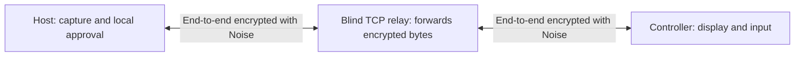

# RustView

RustView is an open-source, cross-platform remote desktop application written in
Rust. Its goal is to share a screen between macOS, Windows, and Linux and to
provide mouse and keyboard control only with the local user's explicit consent.

> [!WARNING]
> RustView is currently in an early stage of development. It has not undergone
> an independent security audit and is not a production-ready alternative to
> TeamViewer or AnyDesk. Do not share your access password with people you do
> not trust, and do not use RustView on sensitive systems.

## Initial MVP scope

The first usable release is intentionally small:

- Share one display as approximately **720p, 5–10 FPS JPEG**
- Basic screen capture on macOS, Windows, and Linux/X11
- Basic mouse and keyboard control after local user approval
- End-to-end Noise encryption between the two clients
- A simple TCP rendezvous/relay service that forwards encrypted data without
  decrypting it
- A persistent, public nine-digit device ID; an 80-bit temporary access password
  regenerated on every application launch; and explicit local approval for every
  incoming request

The initial MVP does **not** include:

- Unattended access or a persistent password
- File transfer, clipboard synchronization, or audio streaming
- Control of the Windows UAC secure desktop or login screen
- Reliable remote input support on Wayland
- A hardware-accelerated video codec or AnyDesk-class latency/bandwidth
  performance
- Direct P2P/NAT traversal; both endpoints connect to the relay in the initial MVP

See the [roadmap](docs/ROADMAP.md) for detailed milestones and the
[platform support matrix](docs/PLATFORM_SUPPORT.md) for operating-system limits.

## How it works

On first launch, RustView generates a persistent, public nine-digit `DeviceId` for
the installation. On every application run, it also generates a random,
16-character, 80-bit `AccessPassword`. This password is never written to disk and
can be regenerated from the application.

The host's identity and temporary password are derived under separate domains into
a 10-byte relay route and a 32-byte Noise PSK. The route is not derived from the
public device ID alone. The relay receives only the route value; the device ID,
access password, and PSK are never sent in plaintext in the relay protocol.
Matched clients perform a `Noise_XXpsk0_25519_ChaChaPoly_BLAKE2s` handshake.
Screen and input data are transferred only after that handshake and after explicit
local approval on the host.



The relay cannot read the screen, input events, access password, or derived Noise
PSK. It can, however, observe IP addresses, route values, connection times, and
metadata such as traffic volume and timing. See the [security design](docs/SECURITY.md)
for details.

## Requirements

- Rust **1.92** or later
- A macOS, Windows, or Linux desktop environment
- Xcode Command Line Tools on macOS
- The MSVC Rust toolchain and the Visual Studio Build Tools “Desktop development
  with C++” components on Windows
- Native development packages for screen capture and windowing on Linux

Example dependencies for Ubuntu/Debian:

```bash
sudo apt-get update
sudo apt-get install -y \
  libclang-dev pkg-config libdbus-1-dev libegl1-mesa-dev \
  libpipewire-0.3-dev libwayland-dev libx11-dev libxcb1-dev \
  libxkbcommon-dev libxrandr-dev
```

Package names may vary by distribution. Wayland screen capture also requires a
working XDG Desktop Portal and PipeWire installation.

## Running in a development environment

After cloning the repository, validate the entire workspace first:

```bash
cargo build --workspace
cargo test --workspace
```

Start the relay in one terminal:

```bash
cargo run -p rustview-relay -- --listen 127.0.0.1:21116
```

The relay listens on `0.0.0.0:21116` by default. For local development, explicitly
binding the loopback address as shown above is safer. The address can also be set
with the `RUSTVIEW_RELAY_LISTEN` environment variable. The relay operator is
responsible for port and firewall configuration when testing over the internet.

> [!CAUTION]
> The MVP relay uses raw TCP. Noise protects screen and input content end to end,
> but the relay server itself is not yet authenticated with a TLS certificate.
> Before operating a public internet service, RustView requires TLS/QUIC,
> distributed rate limiting, bandwidth quotas, observability, and an independent
> security review.

Then launch the desktop application on the host and controller computers:

```bash
cargo run -p rustview-desktop
```

The development flow is:

1. Select the same relay address in both applications.
2. Send the host's displayed nine-digit RustView ID and 16-character temporary
   password to the remote user through a secure channel.
3. The remote user enters the RustView ID, then enters the temporary password in
   the dialog that opens.
4. The remote user can request view-only access or keyboard/mouse control as well;
   control requests are disabled by default.
5. The host reviews the connecting party and requested permissions on the local
   screen and explicitly approves them. View and control permissions are evaluated
   separately.
6. The screen is shared while the session indicator remains active. The host can
   stop the session at any time.

The temporary password changes when the application restarts or when the
**Regenerate** action is selected in the UI. Although a password can be used for
multiple connection requests during the same application run, every request still
requires new local approval on the host. RustView does not provide unattended
access.

Use the help output for relay CLI options. The relay address is saved from the
desktop UI and restored on the next launch. If set, the `RUSTVIEW_RELAY`
environment variable takes precedence over the saved value:

```bash
cargo run -p rustview-relay -- --help
RUSTVIEW_RELAY=127.0.0.1:21116 cargo run -p rustview-desktop
```

PowerShell equivalent:

```powershell
$env:RUSTVIEW_RELAY = "127.0.0.1:21116"
cargo run -p rustview-desktop
```

RustView persists only the public device ID and the non-secret relay address
setting. The default locations for `device-id` and `relay-address` are
`~/Library/Application Support/RustView/` on macOS, `%APPDATA%\RustView\` on
Windows, and `$XDG_CONFIG_HOME/rustview/` on Linux (or `~/.config/rustview/` when
the variable is not set). For tests, portable installations, or custom packaging,
set `RUSTVIEW_CONFIG_DIR` to a directory; RustView creates both files there. The
temporary password is never written to that directory.

```bash
RUSTVIEW_CONFIG_DIR=/tmp/rustview-config cargo run -p rustview-desktop
```

```powershell
$env:RUSTVIEW_CONFIG_DIR = "C:\Temp\rustview-config"
cargo run -p rustview-desktop
```

## Platform permissions

- **macOS:** Screen Recording permission for capture and Accessibility permission
  for remote input are separate. The application may need to be restarted after
  permission is granted.
- **Windows:** The normal user desktop is targeted. The UAC secure desktop, login
  screen, and some protected content are inaccessible.
- **Linux/X11:** Screen capture and basic input are supported; the X11 security
  model does not adequately isolate applications from one another.
- **Linux/Wayland:** Screen capture depends on compositor/portal support and remains
  experimental. When the current MVP build detects a Wayland session, it does not
  enable input injection; control requests safely fall back to view-only mode.

RustView does not attempt to bypass permission screens and does not ask users to
run the entire application as Administrator or root.

## Repository layout

```text
apps/rustview-desktop/       egui/eframe desktop application
crates/rustview-core/        protocol, identity/password derivation, encryption, and shared types
services/rustview-relay/     blind TCP rendezvous/relay service
docs/                        architecture, security, and platform documentation
```

See [ARCHITECTURE.md](docs/ARCHITECTURE.md) for technical components and data flow.

## Contributing and security reports

Contributions are welcome. Read [CONTRIBUTING.md](CONTRIBUTING.md) before starting.
If you discover a vulnerability, do not open a public issue; follow the
[security reporting policy](SECURITY.md).

## License

RustView is available under the [MIT License](LICENSE-MIT).
